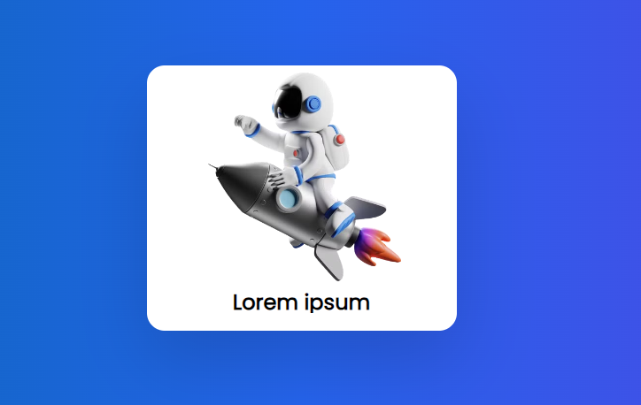

# HOVER ANIMATION
👨‍💻DESTACA O CONTEÚDO AO PASSAR O MOUSE SOBRE O CARTÃO.

  
  

## DESCRIÇÃO:
Este site apresenta uma **animação de hover** aplicada a um **cartão de conteúdo** com imagem e texto.

A ideia é criar uma interação visual elegante que destaca o conteúdo ao passar o mouse sobre o cartão.

## COMO FUNCIONA?
1. Quando o cartão não é interativo, ele mostra a imagem no topo e parte do texto logo abaixo.
2. Ao passar o mouse sobre o cartão, ele aumenta de altura e a imagem é deslocada para cima com um efeito de "zoom out" (reduz de tamanho).
3. O texto expande, revelando mais detalhes, e um botão de "LER MAIS" aparece.

## NÃO SABE?
- Entendemos que para manipular arquivos em `HTML`, `CSS` e outras linguagens relacionadas, é necessário possuir conhecimento nessas áreas. Para auxiliar nesse aprendizado, oferecemos cursos gratuitos disponíveis:
* [CURSO DE HTML E CSS](https://github.com/VILHALVA/CURSO-DE-HTML-E-CSS)
* [CONFIRA MAIS CURSOS](https://github.com/VILHALVA?tab=repositories&q=+topic:CURSO)

## CREDITOS:
- [PROJETO CRIADO PELO "Larissakich"](https://github.com/Larissakich/hover_animation)
- [PROJETO EDITADO PELO VILHALVA](https://github.com/VILHALVA)